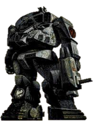
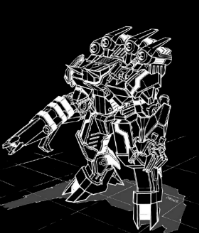
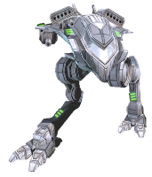
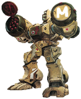
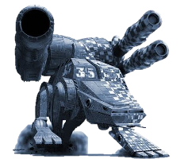
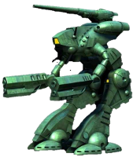
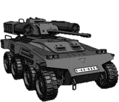

YOUR UNIT FOCUS

All Players select a particular "Unit Focus" for their Battalion, Cluster or Level III. The Unit Focus provides players with a unique minor bonus as well as increased access to Mechs, Combat Vehicles and other assets that are suited for the players "Unit Focus".

HEAVY FORMATIONS - These Lyran special formations feature a high concentration of heavy and assault-class BattleMechs and often form the steel backbone off a heavy line regiment.

Advantage: The Heavy Formations unit focus grants players the option to add one additional commander to their army, above what would normally be allowed, when 50% of the armies mechs are assault-class mechs and no mech or combat vehicle in the army is less than 60 tons in weight. The bonus commander must be placed in an assault mech. The bonus commander's mech may allow the army to have one Assault mech more than normally allowed via the army composition rules.

This unit focus is only available to Lyran faction members. 

 

SHADOW DIVISIONS (Manei Domini) - The Elite shock troops of Precentor Apollyon, these cybernetically enhanced warriors are fanatically loyal to the cause of the Word of Blake, striking ruthlessly and without fear.

Advantage: The Manei Domini Focus gives the player access to the Celestial, Demon, Serpentus and Spectral series of units as well as enhanced pilots for their pilot pool. These enhanced pilots start at "3 Gunnery" and "4 Piloting" and have access to developing some of the special Manei Domini skills such as VDNI, Pain Shunt, BVDNI.

This unit focus is only available to Word of Blake faction members.

CAVALRY FORMATIONS - These formations feature a high concentration of lighter, highly mobile units that can rapidly find and overwhelm an over-confident opponent with lightning fast flanking attacks. The speedy and aggressive nature of these formations often lets the formation dictate where and when a battle will take place.

Advantage: The Cavalry Formations unit focus grants the player the option to re-roll terrain type once when attacking or defending. The player may activate this option anytime before entering the Megamek client. This bonus does not stack with the re-roll normally allowed for defenders whose initial terrain roll is a City terrain.

FIRE SUPPORT FORMATIONS - These formations feature a high concentration of Long-range support units and BattleMechs meant to break the the enemy through sustained and accurate withering direct and indirect fire. The firepower of a modern Fire Support Battalion can level a city within minutes.

Advantages: The Fire Support Formations unit focus grants players to ignore the ammo tonnage limits for ammunition types normally available for their faction. This applies to all units in the player's army.

STORM FORMATIONS - These formations feature a high concentration of BattleMechs specializing in close range combat, often featuring a potent mix of armor,firepower and raw physical might necessary to destroy enemy forces in a brutal close ranged brawl. 
Advantage: The Storm Formation unit focus grants the player the ability to designate an additional commander to their army when attacking. The additional commander must follow all rules regarding which unit is eligible to be designated a commander and must be designated before entering the Megamek client.

MERCENARY FORMATIONS - The universe is ablaze in war and the great houses readily fill their ranks with contract warriors fighting for fame and wealth. The path of the mercenary is not an easy one and successful mercenaries often are the most effective and battle savvy troops in the Inner Sphere.

Advantage: In addition to being able to freely choose which house they will fight for in each tactical campaign they undertake, the Mercenary Formations unit focus allows players to use the "Mercenary Advance" tactical operation, which if successful nets the mercenary increased pay and battle salvage.

This unit focus is only available to Mercenary Faction members. 

COMBINED ARMS FORMATIONS - These formations feature high concentrations of conventional armor units and BattleArmor  either working with BattleMechs or as independent armor formations. Enemies underestimating the power of these units often don't live to make the same mistake twice.

Advantage: The Combined Arms Formations unit allows players to ignore the normal required Mech:Vehicle ratio, and may deploy Combat Vehicles without restriction. Additionally, a player may field a single BattleArmor squad without transport, in addition to any normally transported BattleArmor. This BattleArmor squad may exceed the allowed BattleArmor ratios detailed under the army composition rules.  

Notes: 
Players may change their unit focus once every 50 xp gained in addition to a one-time change at any xp level. Focus changes must occur at the end of a Mini Campaign. To do so contact a staff member.
