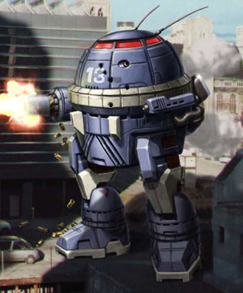
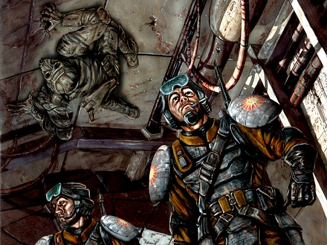

CODES OF CONDUCT

When two players agree to play a game there is a tacit agreement between them to follow the rules. This is the basic foundation of gaming and part of what makes it so enjoyable: Both players agree to a set of parameters that will define a contest between them and use these parameters to challenge each others minds, and through that challenge derive enjoyment.

This outline of friendly competition is the basic premise we believe in at Mekwars: Legends.

Whie there are several rules to follow but perhaps the most important is to respect your opponent while both winning and losing. Everyone loses at one time or another. Do so with grace when it happens to you. Likewise when victory comes show the same grace.  Players, Admins, Mods will not engage in ethic, racial, religious, or sexual intolerance towards other players including derogatory comments regarding a persons ethnicity, race, sex, or creed. 

Players are expected to refrain from any sort of behavior on the server that would give them an unfair advantage over other players, particularly behavior that seeks to exploit loopholes or shortcomings of the software. Players are expected instead to report these issues to a staff member.

All participants in Mekwars: Legends are expected to play in the spirit of friendly competition while on the server and to conduct themselves in adult manner, this includes but is not limited to refraining from the following behaviors deemed childish or adolescent by the community: Private Message "Spamming", "Spamming" main chat areas, interrupting others games without permission, refusing to leave a dedicated host when asked.

Players should also be aware that the community is full of an eclectic bunch of individuals from multiple countries, regions, religions, and economic backgrounds. What is rude to one person may not be rude to the next, as such the Staff prefers to respect peoples individual interpretations and is instructed to err on the side of the individual rather then the group. This does not mean individuals are given a carte blanche to behave in an offensive or annoying manner. It does mean that in deference to personal preferences we strongly encourage players to make liberal use of their ability in client to "mute" individuals that they find offensive or annoying.

NO PLAY LISTS

Like any family, disagreements have and will continue to happen inside the servers community. Oftentimes these disagreements spring up from certain angst over game play styles or hard feelings after a loss. It happens.

Sometimes these disagreements are resolved over time, other times the individuals involved find their disagreements or dislikes so strong that it is best for the parties involved and the community as whole if the possibility of the players playing each other was removed entirely....enter the No-Play List.

The No-Play List is an option for players to exclude another player whom they find is not fun to play against or who the player has serious disagreements with. Ultimately the campaign is about having fun and in the end if you playing someone is proving to be an not fun experience for you we would prefer you have an option not to play that person. To this effect players are given two "no play slots" which they may use each to designate a player that they will be unable to initiate attacks against or have attacks initiated against them. 

If a player finds himself or herself needing more then two No-Play slots then there is a strong chance that the answer to the problems can be found if the said player is in proximity of a mirror. 
