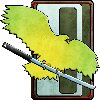

The Crusader Clans' military is built on an unsteady alliance between Clan Jade Falcon and Clan Wolf. While the Wolves favour speed and tactical finesse the Jade Falcons favour firepower and jump mobility. Whether these two very different combat philosophies will complement each other remains to be seen. The Clans forces are divided between the front line clusters which make extensive use of omni-mechs and the second line clusters that are forced to make use of inferior second line machines and tanks.

Clan Jade Falcon Touman/Clan Wolf Touman (Crusader Clans)

Khans: Marthe Pryde/Vladmir Ward
 SaKhans: Samanta Clees/Marialle Raddick
 BattleMech Strength: Approximately 99 Clusters
 Base Gunnery/Piloting: 3/4

Clan Wolf Touman (CW)

Clusters:
 1st Wolf Guards Grenadiers Cluster
 2nd Wolf Guards Grenadiers Cluster
 Blue Keshik
 Bronze Keshik
 Dark Keshik
 Golden Keshik
 Green Keshik
 Grey Keshik
 Red Keshik
 Silver Keshik
 Wolfkin Keshik
 4th Striker Cluster
 103rd Striker Cluster 
 1st Wolf Assault Cluster 
 2nd Wolf Assault Cluster 
 3rd Wolf Battle Cluster 
 5th Wolf Battle Cluster 
 9th Wolf Guard Striker Cluster 
 7th Battle Cluster 
 11th Battle Cluster 
 13th Battle Cluster 
 101st Battle Cluster
 271st Assault Cluster 
 1st Wolf Lancers 
 2nd Wolf Lancers 
 3rd Wolf Lancers 
 1st Wolf Regulars
 6th Wolf Regulars
 12th Wolf Regulars
 13th Wolf Regulars
 17th Wolf Regulars
 20th Wolf Regulars
 21th Wolf Regulars
 2nd Wolf Cavalry
 5th Wolf Cavalry
 6th Wolf Cavalry
 33rd Wolf Champions Cluster
 1st Wolf Garrison Cluster
 4th Wolf Garrison Cluster
 5th Wolf Garrison Cluster
 6th Wolf Garrison Cluster
 7th Wolf Garrison Cluster
 1st Wolf Hussars Cluster

Clan Jade Falcon Touman (CJF)

Clusters:
 Turkina Keshik
 Jade Falcon Guards 
 1st Falcon Hussars 
 1st Falcon Velites
 2nd Falcon Velites 
 3rd Falcon Velites 
 3rd Falcon Talon Cluster 
 5th Talon Cluster 
 7th Talon Cluster
 8th Talon Cluster 
 9th Talon Cluster 
 10th Talon Cluster
 12th Talon Cluster 
 1st Falcon Swoop Cluster 
 2nd Falcon Swoop Cluster 
 3rd Falcon Swoop Cluster 
 Gyrfalcon Solahma Cluster 
 Jade Solahma Cluster 
 Lambda Solahma Cluster 
 Omega Solahma Cluster 
 Sigma Solahma Cluster
 Zeta Solahma Cluster
 1st Falcon Jaegers 
 2nd Falcon Jaegers 
 3rd Battle Cluster 
 5th Battle Cluster 
 53rd Battle Cluster 
 74th Battle Cluster 
 5th Falcon Regulars
 7th Falcon Regulars 
 8th Falcon Regulars 
 12th Falcon Regulars 
 18th Falcon Regulars
 5th Provisional Garrison Cluster
 6th Provisional Garrison Cluster
 7th Provisional Garrison Cluster
 8th Provisional Garrison Cluster 
 9th Provisional Garrison Cluster
 10th Provisional Garrison Cluster
 11th Provisional Garrison Cluster
 22nd Provisional Garrison Cluster
 24th Provisional Garrison Cluster
 51st Garrison Cluster
 1st Falcon Striker Cluster
 4th Falcon Striker Cluster
 1st Falcon Dragoons
 2nd Falcon Dragoons
 3rd Falcon Dragoons
 4th Falcon Dragoons Cluster 
 73rd Striker Cluster 
 75th Striker Cluster
 109th Striker Cluster 
 124th Striker Cluster
 Gyrfalcon Eyrie Cluster 
 Jade Falcon Eyrie Cluster 
 Pryde Eyrie Cluster 
 Turkina Eyrie Cluster
 305th Assault Cluster 

