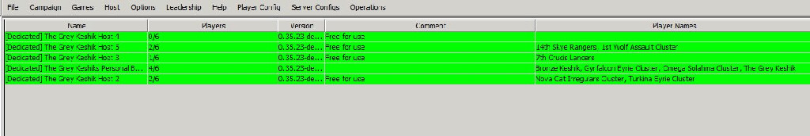
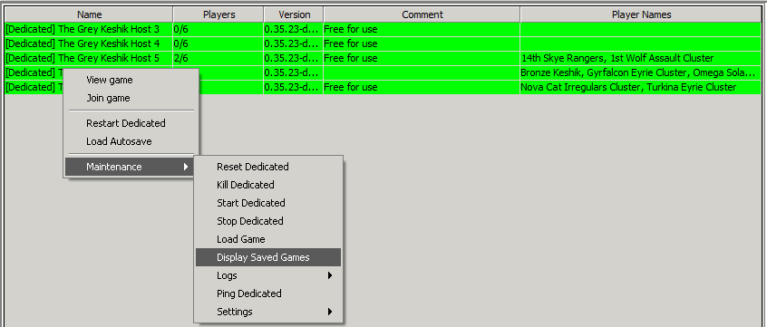
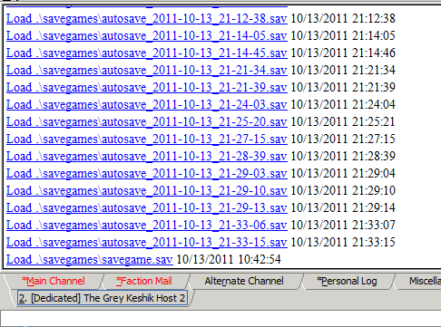

CURRENT BATTLES TAB

Once players get matched up in a game the first question is often so where do I play this. The answer is simple - the Current Games tab. The current games tab displays all of the dedicated MegaMek hosts that the server makes available for games. There are several such dedicated hosts running at any given time.  To enter a dedicated host simple double click on it.

Players and observers entering the dedicated hosts are reminded to follow all the rules for Starting, Playing and Ending games while inside the hosts. Players may also need to interact when loading saved games. Saved Games may be loaded by right-clicking on a host and calling up the host controls panel to select the "Display Saved Games" option.

After selecting "display saved games a list of the saved games will be sent as a private messages to the player along his chat tab. The player then simply needs to select a saved game from the list to load the game into the dedicated hosts. It is important to note that players must re-enter the host to continue a game with the exact same name that they used while starting the game (Their account name).

If a player ever is finds themselves being assigned a duplicate connection in a game for example "Davion Heavy Guards" enters host and find his name is "Davion Heavy Guards.1"  the player should not continue the game until he successfully connects as his exact account name.

After a game is completed players are expected to exit the host in a timely manner and "clean up" after themselves by resetting the dedicated host as the leave. Additionally if the players involved in the game bilaterally changed any of the default campaign MegaMek settings they are expected to make sure the dedicated is properly returned to those settings. 
