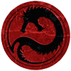

THE DRACONIS COMBINE

Founded in the 24th century by Shiro Kurita, the Draconis Combine is a modern day embodiment of Tokugawa Japan. The Coordinator, like the Shoguns of old, carefully balances a realm ruled by semi-autonomous Warlords possessing their own loyal armies. He is aided in this endeavor by spies, secret societies, ninja, and loyal retainers. The Dragon's subjects hold thoughts of honor and duty, driving even the criminal and outcast to passionate service of the realm. Most importantly, the spirit of the samurai lives within the souls of the Dragon's soldiers, motivating them to feats of bravery, sacrifice, and slaughter beyond what most would call sane.

Though possessing a society obsessed with the traditions of the past, the Draconis Combine has time and again proven resilient, flexible, and adaptive. The Combine accomplished all of this by maintaining the most diverse military force in the galaxy: the rank and file samurai of the provincial regiments; the hand-picked elite of the Swords of Light; the Kell Hounds-inspired Genyosha; the Wolf's Dragoons-inspired Ryuken; the misfits and outcasts of the Legions of Vega; the yakuza and warrior women of the Ghost Regiments; the Muslim warriors of the Arkab Legions. With the new training reforms begun under Takashi Kurita and continued by his son, Theodore, the average Draconis soldier commands an unrivaled repertoire of tactics.

In the fires of the Jihad, the Draconis Combine finds itself, as always, surrounded by dangerous foes. Traditional rivals like the Federated Suns and the Lyran Commonwealth watch for weakness, as they always have. The Ghost Bear Dominion and wily Diamond Sharks eye the rich planets of the Draconis Combine with envy, While the Crusader Clans circle ever looking for weakness within the Dragon.  The Combine will require all its strength to survive the coming storm.

Playable Subfactions:
Draconis Combine Mustered Soldiery (DCMS)
