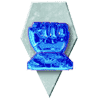

LYRAN ALLIANCE

Business rules in the Alliance. The descendant of the Lyran Commonwealth, the Alliance was born from the maniacal ambitions of Katherine Steiner-Davion and struggles with an uncertain future presented from a violent past.  Citizens of the Alliance take great pride in knowing their nation is still the economic powerhouse of their ancestors. The skilled, well educated and well organized industrial sector is still the envy of the Inner Sphere, the volcanic heart of the Lyran nation. Defiance Industries and Coventry Metalworks continue to churn out the finest battlemechs in the Inner Sphere, while the service academies of the DME continue to produce talented pilots and mechwarriors.

But the recent past of has left destructive cancers gnawing at the heart of the Lyran Alliance.  Political cronyism, a product of the last two Archons' rapid change in power has left the LAAF saddled with incompetent armchair generals. Men and women with little qualification to lead troops into battle now do exactly that, wasting the skill and professionalism of the LAAF's soldiers. The LAAF is the single largest fighting force in existence, but many formations are mere shadows of their former prestige. Still, average quality of Lyran designs remains excellent, with a notable “bigger is better” mentality dominating procurement, and many troops are battle-hardened by the crucible of the Fed-Com Civil War.

Whether it has been the cavalier ambitions of the Mariks, the tyrannical aggression of the Kuritas, or the quasi-religous fanaticism of the Word of Blake, or even the fury of the Clans, the Lyran people have defied the odds time and again. In the end they will prevail the way the old Lyran Commonwealth always had: with blood, steel and cold hard cash.

Playable Subfactions:  

Lyran Alliance Armed Forces (LAAF)
