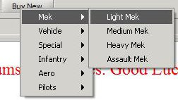
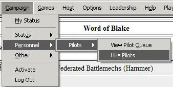

YOUR QUARTERMASTER TAB

Godfrey rolled his eyes over the jumpship’s manifest. It was more or less what he had expected, given the state of the LAAF at the moment. One line, however, caught his attention for more than a few moments.

“A Nightstar.” He chuckled. “Someone in the QMD must like me.”

You have chosen your faction, unit name, unit focus and are ready to join the struggle for victory with your new faction mates. Whats next? Well you need the men and machines necessary to fill out your unit, and that requires a trip to the quartermaster!

When a player creates an account and joins a faction assuming a unit name, the faction assigns the players unit a number of Techs or Technicians to maintain equipment. A players number of techs is the ultimate determining factor in how many and what kind of combat equipment--mechs, tanks, battle armor, etc.--that a player begins each mini campaign with. Each type of combat equipment has a specific Tech Cost which represents the amount of logistical support the combat element needs to stay in your unit. The Quartermaster tab is where you will be able to request new combat equipment (including your initial forces).

There are two important parts of the Quartermaster tab, the upper portion shows the factories currently available for the quartermaster to draw initial and replacement equipment for you. The factories are displayed divided by classifications used during the campaign. Below the factories there is the "Request equipment" (aka "Buy New") button. This is where you as the unit commander request new equipment from your faction. The button opens up into a sub-menu that allows you to request the type and class of combat equipment you want from the factions available factories and stockpiles. There are two crucial components of required to make a purchase or request--Techs and Influence (Flu).

As mentioned above, Techs represent the logistics support afforded to your unit by your faction, and are necessary to maintain combat equipment depending on the type and class of the equipment requested. However while you have the Techs necessary to support a mech or tank, you also need the influence necessary to do so. Influence represents standing with your regional headquarters, goodwill of quartermasters and a general ability to "grease the wheels" and get your unit the equipment it needs. Influence is replenished by completing Mini Campaigns.

Requesting new combat equipment generally costs a single point of Influence. per request As previously stated the tech costs for combat equipment vary - Players start with around 682 Technicians, along with 1000 influence with which they may build their initial forces.

Players are advised to make sure they are familiar with any army composition rules before deciding on purchasing new equipment. Players should always use all available techs when they requesting their initial forces and at any additional refit period which they enter into. It is extremely important that players remember not to go active until they have built their units' full complement of equipment. Going active will remove your influence (once you leave base for a while the quartermaster forgets about that case of Canopian Whiskey you gave him!)

| Combat Equipment         | Tech Cost| Influence Cost|Needs Pilot|
| -------------------------|----------| --------------|-----------|
| Light Mech               | 8        | 1             |Yes        |
| Medium Mech              | 12       | 1             |Yes        |
| Heavy Mech               | 16       | 1             |Yes        |
| Assault Mech             | 20       | 1             |Yes        |
| Combat Transport         | 4        | 1             |No         |
| Light Armor (5-55 tons)  | 6        | 1             |No         |
| Heavy Armor (60-100 tons)| 12       | 1             |No         |
| Battle Armor             | 2        | 1             |No         |

After players have built their initial forces they will need to acquire the personnel needed to pilot their warmachines. Mechwarriors may be requested via the personnel menu located under the same campaign tab you used to defect. You may request up to ten new pilots at a time. However, if you already have pilots of that type not assigned to a unit you will not be allowed to request new ones. Battle Armor and Conventional combat vehicles come with the crews and troopers necessary to operate them. 

Now that you have the men and machines you need to wage battle against your faction's enemies its time to manage your headquarters for your Mini-campaign.
