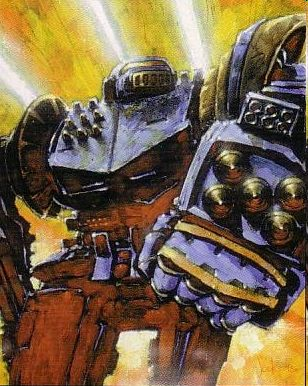

WORD OF BLAKE MILITARY

The Word of Blake has secretly armed itself towards becoming the most technologically advanced and fearsome force the Inner Sphere has seen in some time. The size and scope of the Word of Blake Militia has shocked the powers that be. Believing the Militia to be but ten divisions strong the true scope of the Sword of Blake shocked and demoralised them. Now the Word of Blake possesses possibly the single strongest military in the Inner Sphere and who knows what Blakist technological terrors lurk in the shadows.... Whether the Words huge military is strong enough to take on the entire Inner sphere though is a question that only time will tell.... 

Word of Blake Militia and Shadow Divisions

Commander: Precentor Martial Cameron St. Jamais
Aide: Precentor Naval, Gregory Zwick
Strength: Unknown

Blake Militia Divisions:
Base Gunnery/Piloting: 4/5

 1st Division IV-beta
 2nd Division IV-gamma
 3rd Division IV-mu
 4th Division IV-iota
 5th Division IV-eta
 6th Division IV-theta
 7th Division IV-iota
 8th Division IV-kappa
 9th Division IV-gamma
 10th Division IV-beta
 11th Division IV-sigma
 12th Division
 13th Division IV-mu
 14th Division IV-nu
 15th Division IV-delta
 16th Division IV-eta
 17th Division IV-kappa
 18th Division IV-delta
 19th Division IV-omicron
 20th Division IV-sigma
 21st Division
 22nd Division IV-omicron
 23rd Division IV-zeta
 24th Division IV-iota
 25th Division IV-beta
 26th Division IV-epsilon
 27th Division IV-alpha
 28th Division IV-xi
 29th Division IV-omega
 30th Division IV-gamma
 31st Division
 32nd Division
 33rd Division
 34th Division
 35th Division
 36th Division
 37th Division
 38th Division
 39th Division

Shadow Divisons:
Base Gunney/Piloting: 3/4

 40th Shadow Division
 41st Shadow Division
 42nd Shadow Division
 43rd Shadow Division
 44th Shadow Division
 45th Shadow Division
 46th Shadow Division
 47th Shadow Division
 48th Shadow Division
 49th Shadow Division
 50th Shadow Division
 51st Shadow Division
 52nd Shadow Division
 Opacus Venatori
