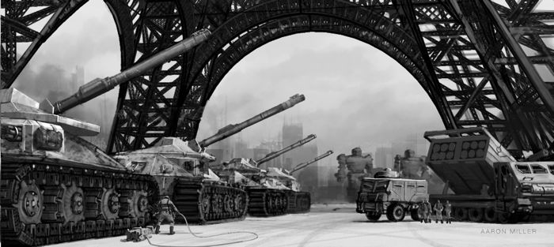

# Artillery

The traditional "king of the battlefield" in many of Terra's great wars, Artillery remains an important component of military operations in the 31st century. The rediscovery of  "Lostech" has increased the potency of battlefield artillery dramatically as laser guided artillery units such as the Arrow IV launcher are appearing once more with increasing frequency across the Inner Sphere.

Artillery is to be deployed at players' discretion within the following rules:

* for armies 8000bv-12000bv: no more than two (2) individual artillery weapons allowed
* for armies 12001-25000bv: no more than four (4) individual artillery weapons in the force
* for armies 25001 bv and up: no restrictions.

At any BV artillery weapons must be deployed on-map and may *never use the off-map deployment* option.

> EXAMPLE: Christopher Columbus is fighting a 14,000 BV battle.  He attempts to bring a two Naga Prime (a Clan mech with two Arrow IV launchers) and a Long Tom!!.  This is illegal, because at this BV he may only have four individual artillery weapons, while he is attempting to use five!

