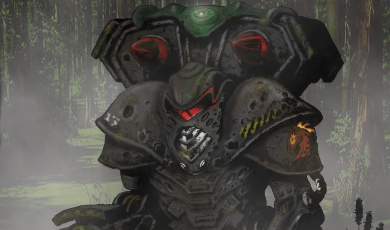

# BATTLE ARMOR

> Infantry units have always formed the backbone of armies since the invention of gunpowder. With the discovery of the Grey Death memory core, and the subsequent arrival of the clan "elemental" in the Inner Sphere during Operation Revival, power armored infantry or "Battle Armor" troops have become increasingly common on the battlefields of the Inner Sphere. Conventional Infantry have long played a role in 31st century but with every new advance in Battle Armor research and development, many have begun to predict that one day Battle Armor Infantry will replace even Mechs as the kings of the battlefield.

## BATTLE ARMOR DEPLOYMENT RULES:

A force must have enough transport capacity to account for all battle armor in the force. Battle Armor requires transport based on their equipment with the following guidelines:

Battle Armor having a jump or flanking speed of 5 or more Movement Points do not require transport.

If equipped with magnetic clamps, a Battle Armor unit may be transported by any mech or vehicle, whether inside the cargo space of a transport vehicle combat transport with the appropriate cargo space (4, 5 or 6 tons per squad) or attached to another unit in the force able to carry it.

If equipped with boarding claws, battle claws, or manipulators that allow them to mount omnimechs or omnivehicles, a Battle Armor unit may be transport either by a omnimech, omnivehicle, or within a combat transport with the appropriate cargo space (4, 5 or 6 tons per squad).

Any Battle Armor unit that is incapable of moving 5 or more (either flanking or jumping) and lacks magnetic clamps, boarding claws, battle claws, or any manipulators which allow them to mount omnimechs or omnivehicles must be transported by a vehicle combat transport with the appropriate cargo space (4, 5 or 6 tons per squad).

Battle Armor do not need to begin the game inside or attached to their corresponding transport, and may be deployed up to 3 hexes away from said transporting unit within a players deployment zone.

The number of Battle Armor in an army may never exceed the number of mechs and Combat Vehicles (excluding transports) in an army.